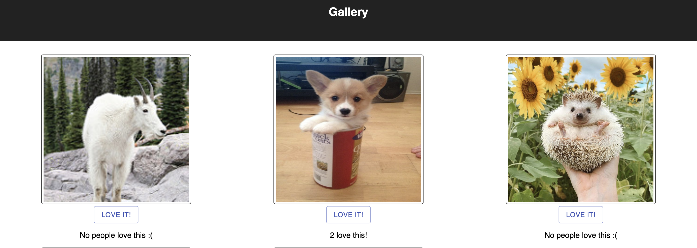

# Photo Gallery

## Description

Full-Stack Application using: React.js, Axios, and Material-UI.

This project creates a gallery of images that allows a user to like a photo and click on an image to see a description. Conditional rendering is used to show the image/description of a photo as well as when there are no likes on a photo and a photo is liked. 

